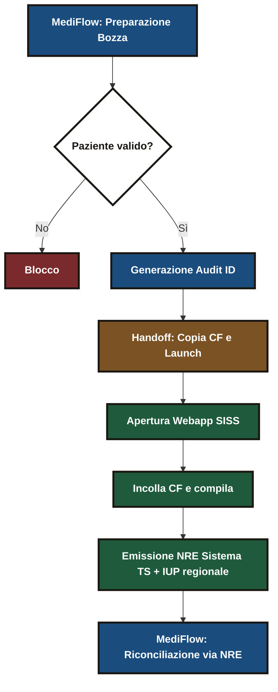
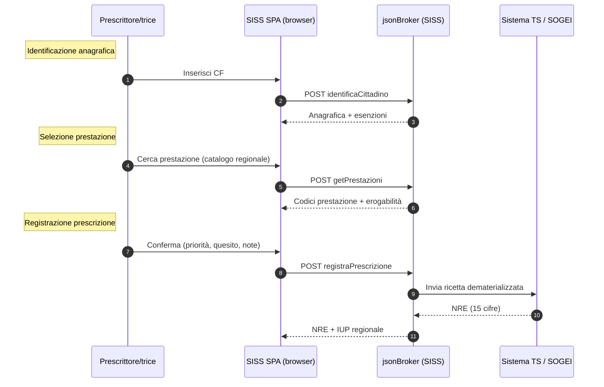

> **Nota metodologica.** Questo post è una ricostruzione osservazionale del comportamento del portale SISS lombardo a partire dal traffico applicativo del browser e dalla letteratura pubblica sui flussi della ricetta dematerializzata. Non è documentazione ufficiale né specifica fornita dal gestore regionale. I nomi di endpoint, la sequenza delle chiamate, l'allocazione dei ruoli di firma e identità sono ipotesi di lavoro coerenti con quanto osservato in produzione, ma soggette a errori e a cambiamenti non documentati. Va letto come *appunto di indagine*, non come riferimento normativo.

La ricetta dematerializzata sembra un processo banale. Chi prescrive la compila, il sistema produce un numero a quindici cifre, il **NRE** (Numero Ricetta Elettronica), e il punto di erogazione legge quel numero per prendere in carico la prescrizione: la **farmacia** quando si tratta di un farmaco, il **CUP** (Centro Unico di Prenotazione) o il sistema di prenotazione aziendale/regionale quando si tratta di una prestazione specialistica. Lo stesso identificativo, due circuiti diversi a valle, due interlocutori operativi distinti. Sotto la superficie ci sono inoltre almeno quattro livelli che parlano linguaggi diversi: identità di chi prescrive, autorizzazione regionale al gesto clinico, firma elettronica qualificata sull'atto, registrazione presso il **Sistema TS** (Sistema Tessera Sanitaria) gestito da SOGEI per conto del MEF (Ministero dell'Economia e delle Finanze). Quando uno qualsiasi di questi livelli si inceppa, chi prescrive se ne accorge perché il portale gira a vuoto, non perché il sistema dica cos'è andato storto.

Nelle scorse settimane mi sono occupato di mappare e implementare il flusso prescrittivo su MediFlow verso il **SISS** (Sistema Informativo Socio Sanitario) di Regione Lombardia. Questo post documenta come si entra dentro al meccanismo, dove sta oggi il collo di bottiglia, e perché una UI (interfaccia utente) dedicata avrebbe margini di miglioramento concreti.

> **Nota sugli acronimi.** Il dominio è denso. Alla prima occorrenza ogni sigla è scritta per esteso. Le ricorrenti sono: NRE (Numero Ricetta Elettronica), IUP (Identificativo Univoco di Prescrizione, regionale), SAC (Sistema di Accoglienza Centrale, lato Sistema TS), SAR (Sistema di Accoglienza Regionale, lato SISS), CNS (Carta Nazionale dei Servizi), TS-CNS (Tessera Sanitaria con funzioni di CNS), CUP (Centro Unico di Prenotazione), PHI (Protected Health Information, dati sanitari protetti), AgID (Agenzia per l'Italia Digitale), AIC (Autorizzazione all'Immissione in Commercio, codice farmaco).

## Identità di chi prescrive: CNS, firma remota e perché contano per i gestionali

Prima ancora di parlare di ricette, conviene mettere a fuoco chi prescrive, agli occhi del sistema, nel momento in cui si apre il portale.

L'autenticazione al SISS si poggia su una **identità digitale forte**: in Lombardia tipicamente CNS (Carta Nazionale dei Servizi) o TS-CNS (Tessera Sanitaria con funzioni di CNS) letta da smart card via lettore USB, con possibilità di OTP (One-Time Password, codice usa-e-getta) delegato in alcune configurazioni. L'identità non è solo un login: la smart card contiene certificati X.509 che permettono a chi prescrive di compiere atti giuridicamente rilevanti, fra cui la firma elettronica qualificata sulle ricette.

Qui entra la **firma remota**. In molti scenari lombardi non viene usata la smart card per ogni atto: chi prescrive dispone invece di un certificato di firma qualificata conservato in un **HSM** (Hardware Security Module, un dispositivo crittografico fisico che custodisce le chiavi private in modo che non possano essere estratte) presso un certificatore accreditato AgID. I nomi ricorrenti sul mercato italiano sono Aruba, InfoCert, Namirial, Intesi Group. Ogni firma viene attivata tramite un binomio PIN statico + OTP dinamico, tipicamente via app TOTP (Time-based One-Time Password, codice a 6 cifre che cambia ogni 30 secondi, lo standard di Google Authenticator) o SMS.

Sotto al cofano, l'API del certificatore espone una funzione di firma che riceve l'**hash** del documento (l'impronta digitale crittografica, calcolata lato client per non trasferire l'intero documento) e restituisce il blocco firmato. Tecnicamente il payload firmato è un **PKCS#7** (lo standard del Cryptographic Message Syntax, contenitore che lega il documento, la firma e il certificato di chi firma) racchiuso in due formati: **PAdES** (PDF Advanced Electronic Signature, per i documenti PDF) o **CAdES** (CMS Advanced Electronic Signature, per i payload XML come quelli della ricetta dematerializzata). L'accesso all'HSM avviene di solito via API REST proprietaria del certificatore o, nei deployment più tradizionali, tramite **PKCS#11** (un'API standard per parlare con dispositivi crittografici, originariamente nata per smart card, qui simulata in software). Sul singolo atto la firma resta granulare, ma la sessione di autorizzazione (il consenso a firmare) può estendersi a una finestra temporale o a un set di operazioni dichiarato, riducendo di fatto il numero di OTP da digitare.

L'aspetto interessante, dal punto di vista di un gestionale, è il seguente: la stessa identità che firma le ricette **può essere usata per autenticare chi prescrive verso servizi terzi**, a patto che il fornitore esponga un meccanismo conforme. I pattern realistici sono tre:

1. **Federazione SPID/CIE.** Quando il servizio terzo si registra come *Service Provider* SAML (Security Assertion Markup Language, lo standard XML per scambiare asserzioni di identità fra IdP e SP), può accettare login con SPID (Sistema Pubblico di Identità Digitale) o CIE (Carta d'Identità Elettronica).
2. **OAuth2 con OpenID Connect (OIDC).** Un *Identity Provider* (IdP) regionale rilascia un token JWT (JSON Web Token) al gestionale. Il certificato di firma qualificata può essere legato al token come *proof-of-possession*: nel claim `cnf` (confirmation) del JWT si inserisce il `x5t#S256`, ossia l'hash SHA-256 del certificato X.509 di chi prescrive. Chi riceve il token può verificare che chi lo presenta possieda anche la chiave privata corrispondente.
3. **Mutual TLS server-to-server.** Il backend del gestionale e quello regionale si autenticano a vicenda con certificati X.509 emessi da una CA (Certification Authority) riconosciuta. Niente username/password, niente token: il canale stesso è l'autenticazione.

In ogni caso la firma remota non firma soltanto: certifica un'identità verificata, con catena di trust ancorata ad AgID, e questa identità è riusabile per ottenere un token di sessione applicativo. La verifica della validità del certificato in tempo reale resta a carico del relying party (chi accetta la firma): si fa interrogando il certificatore via **OCSP** (Online Certificate Status Protocol, una query HTTP che chiede "questo certificato è ancora valido?"), con fallback su **CRL** (Certificate Revocation List, lista periodica dei certificati revocati, più lenta ma sempre disponibile).

L'inferenza che muove la mia architettura è questa: se domani un gestionale come MediFlow potesse presentarsi al SISS con la medesima identità con cui chi prescrive già firma, l'attuale doppio passaggio (login al portale + compilazione manuale) collasserebbe in una sola autenticazione. La UI del portale, che oggi è l'unico canale, smetterebbe di essere un vincolo.

> Resta da capire (e non lo verifico in questo post) **a che condizioni il gestore regionale accetta credenziali di firma remota come token di sessione applicativa**. È esattamente questo il punto di pressione su cui un'interfaccia dedicata avrebbe senso.

### SAR, SAC e firma qualificata: tre layer da non confondere

Una volta identificata la persona prescrittrice, l'atto prescrittivo viaggia su un'infrastruttura a strati che è facile confondere. Vale la pena fissarli, perché ogni layer ha un proprio gestore, un proprio formato e un proprio punto di fallimento.

- **SAC (Sistema di Accoglienza Centrale).** È il nodo nazionale gestito da SOGEI (la società IT del MEF) per il Sistema TS. Riceve la ricetta dematerializzata in formato XML conforme al tracciato pubblicato dal MEF, restituisce il NRE, mantiene lo stato del ciclo di vita della ricetta (emessa, presa in carico, erogata, annullata). È il riferimento autoritativo per farmacia e CUP che, in fase di dispensamento o prenotazione, interrogano il SAC tramite NRE per recuperare la ricetta firmata.
- **SAR (Sistema di Accoglienza Regionale).** È l'intermediario regionale che si interpone fra i sistemi delle aziende sanitarie/gestionali e il SAC. In Lombardia il SAR vive dentro il SISS e copre due funzioni: instradare le ricette verso il SAC nazionale e tenere uno specchio regionale dei flussi per finalità rendicontative, di governo della spesa e di erogazione regionale. Quando il portale SISS chiama `registraPrescrizione`, è il SAR che riceve, normalizza, firma se necessario e inoltra al SAC. Il SAR è anche il responsabile dell'IUP regionale.
- **Firma qualificata sull'atto.** La ricetta dematerializzata viaggia come XML firmato secondo le specifiche MEF (firma CAdES sul payload, conforme al **CAD**, Codice dell'Amministrazione Digitale ex D.lgs. 82/2005, e al regolamento europeo **eIDAS** n. 910/2014, che disciplina l'identità elettronica e i servizi fiduciari fra Stati membri). Sul piano operativo, la firma può essere apposta in due momenti distinti: da chi prescrive, tramite il proprio certificato di firma remota, sul singolo atto; oppure dal SAR per conto della persona prescrittrice, in regime di firma server-side, dove la sessione CNS vale come consenso a firmare entro un perimetro definito. Quale dei due modelli si applichi a una data prescrizione dipende dalla configurazione regionale e dalla tipologia di ricetta. Non è documentato in modo pubblico e va inferito dal comportamento osservato.

L'implicazione architetturale è che il gestionale, per evitare il portale, non dovrebbe replicare un solo gateway ma orchestrare tre interlocutori: l'IdP (Identity Provider) regionale per la sessione, il SAR per l'instradamento e la firma, il certificatore per la firma qualificata quando questa non sia delegabile al SAR. Ognuno di questi tre layer ha proprie SLA (Service Level Agreement, livelli di servizio contrattualizzati), propri tempi di indisponibilità, propri formati di errore. Un client nativo deve gestirli tutti, e questa è una delle ragioni profonde per cui l'handoff resta oggi economicamente sensato.

## Il portale SISS attuale: SPA legacy, jsonBroker e sessione browser come unico canale

Il portale prescrittivo SISS si presenta come una **SPA** (Single Page Application, applicazione web che carica una sola pagina HTML e aggiorna dinamicamente il contenuto via JavaScript, senza navigare fra URL diverse) di generazione precedente, con impianto **jQuery Mobile** (un framework UI per dispositivi touch nato intorno al 2010, oggi non più mantenuto, ma all'epoca standard de facto per portali web "mobile-friendly"). L'intero flusso prescrittivo è imperniato su un singolo endpoint di routing applicativo lato server, osservato come `POST /prescrizione/jsonBroker`, con dispatch su un parametro `operation`. Questo significa che il client non chiama URL diversi per operazioni diverse: chiama sempre lo stesso endpoint e il server distingue cosa fare in base al campo `operation` nel corpo della richiesta JSON. È un pattern **RPC** (Remote Procedure Call, chiamata di procedura remota: il client invoca una funzione del server come se fosse locale), variante più semplice e meno documentata di **JSON-RPC**. L'intero flusso, dall'autenticazione fino all'emissione del NRE, è ancorato alla sessione browser e ai cookie del dominio regionale: senza quella sessione viva nel browser non è possibile chiamare il broker.

Costruire oggi un client *nativo* (server-to-server, senza passare dal browser) in MediFlow significherebbe ricostruire due livelli paralleli: la sessione SISS con autenticazione CNS lato server, e il dialogo a valle verso il Sistema TS/SOGEI per la registrazione della ricetta dematerializzata. Entrambi richiederebbero accreditamento formale come applicativo terzo presso il gestore regionale, gestione di certificati X.509 lato server, e un perimetro di trattamento di **PHI** (Protected Health Information, i dati sanitari personali soggetti al GDPR art. 9 e alle linee guida del Garante) molto più ampio di quello attualmente necessario al gestionale.

La scelta adottata in MediFlow è un **disaccoppiamento esplicito**: il gestionale non emette direttamente la ricetta, ma funge da *Draft Builder* locale, delegando al portale SISS l'atto formale di prescrizione.

## Handoff assistito: copia del CF, doppio pannello e RPC sincrone sul broker

La gestione a due pannelli permette di consultare i dati clinici a sinistra e operare sul SISS a destra. MediFlow avvia il portale e copia il Codice Fiscale negli appunti, semplificando la prima barriera di ingresso: la ricerca anagrafica del paziente.

L'uso della clipboard di sistema (gli "appunti" di Windows/macOS) come canale di handoff è un compromesso consapevole. Riduce la frizione operativa ma introduce un piccolo perimetro di rischio: *clipboard hijacking* da parte di altre applicazioni che leggono gli appunti senza che l'utente se ne accorga, oppure persistenza del CF in clipboard manager di terze parti (utility che memorizzano cronologia degli appunti). MediFlow svuota il buffer dopo un breve **TTL** (Time-To-Live, durata massima prima dello scadere) e, in roadmap, è prevista la sostituzione con un protocollo `mediflow://` registrato lato OS, cioè uno schema URL custom (come `mailto:` o `tel:`) che il sistema operativo associa al gestionale e usa per passare dati direttamente senza transitare per la clipboard.

Il vero collo di bottiglia del modulo regionale è la sequenza **sincrona** imposta dal `jsonBroker`: ogni operazione (identificazione, ricerca prestazione, registrazione) è una chiamata RPC distinta verso lo stesso endpoint, e il client deve aspettare la risposta della prima prima di poter inviare la seconda. Non esiste, almeno nel traffico osservato, un meccanismo di *batching* (impacchettare più operazioni in una sola richiesta) o di chiamate parallele. Il risultato è che il tempo percepito a video è la somma dei tempi di andata e ritorno di ciascuna chiamata.

> I nomi delle operazioni (`identificaCittadino`, `getPrestazioni`, `registraPrescrizione`) sono etichette descrittive coerenti con il payload osservato, non identificativi ufficiali. Il broker espone una struttura RPC-like con dispatch su un parametro `operation` o equivalente.

Sull'output dell'atto è utile distinguere due identificativi che il portale restituisce insieme ma che vivono in spazi semantici diversi:

- **NRE.** Numero Ricetta Elettronica, 15 cifre, generato dal Sistema TS, identificativo nazionale della prescrizione dematerializzata. È il codice che il punto di erogazione utilizza per scaricare la ricetta dal SAC. **Importante**: il "punto di erogazione" cambia a seconda della natura della prescrizione. Se la ricetta è farmaceutica, l'NRE viene letto dalla **farmacia** in fase di dispensamento. Se la ricetta è specialistica, l'NRE viene letto dal **CUP** (o dal sistema di prenotazione regionale/aziendale) in fase di presa in carico. Lo stesso identificativo, due circuiti diversi, due interlocutori diversi a valle dell'atto prescrittivo.
- **IUP.** Identificativo Univoco di Prescrizione di livello regionale, utile alla riconciliazione interna al SISS e ai flussi rendicontativi lombardi, ma non sufficiente per il dispensamento al di fuori del circuito regionale.

Questa doppia natura del NRE è esattamente la ragione per cui un portale prescrittivo deve sapere, fin dal data entry, **se ciò che si sta prescrivendo è farmaco o specialistica**: cambia non solo il catalogo di lookup (banca dati AIC del farmaco contro nomenclatore tariffario specialistica), ma anche il canale di smaltimento a valle. È uno dei nodi su cui si gioca l'evoluzione di PRREG, oggetto di un'analisi successiva.

L'adapter di MediFlow è progettato per **non conservare credenziali né stato della sessione regionale**. Si limita a rilevare i failover dell'infrastruttura lombarda. Quando il portale SISS restituisce timeout o errore sulla `registraPrescrizione`, la bozza su MediFlow viene ripristinata in stato *non emessa*, per evitare false certezze di prescrizione. Un errore di routing su un farmaco è un evento avverso con responsabilità chiare.

## Il canone dei gestionali open source: handoff sul menu SISS e arrivo di PRREG

Il pattern di MediFlow non è un'eccentricità di un singolo gestionale. È **il canone di fatto** per gli applicativi ambulatoriali in Lombardia, in modo particolare per quelli open source o di piccoli fornitori che non hanno percorsi di accreditamento applicativo verso il SISS. La strategia è sempre la stessa: il gestionale prepara una bozza locale, copia il Codice Fiscale negli appunti, lancia il browser sul **menu SISS** ([operatorisiss.servizirl.it/menusiss](https://operatorisiss.servizirl.it/menusiss/#)), e da lì chi prescrive opera sull'interfaccia "stock" che Regione Lombardia mette a disposizione di tutto il personale autenticato.

In questo modo l'onere dell'integrazione formale resta a carico del solo gestore regionale, e il gestionale rimane *fuori* dal perimetro della ricetta. È inelegante, ma scala su qualsiasi software, incluso quello scritto in un weekend da un singolo MMG.

Il cambiamento rilevante in corso è l'arrivo del **Prescrittivo Regionale (PRREG) Produzione**, esposto dal menu SISS accanto al vecchio modulo. PRREG è la nuova interfaccia stock destinata, presumibilmente, a sostituire il prescrittivo storico basato su `jsonBroker`. Le differenze osservate non sono solo cosmetiche:

- **Campo libero per le prestazioni.** Là dove il vecchio portale chiedeva di selezionare a monte la branca (farmaceutica o specialistica) e poi cercare nei rispettivi cataloghi, PRREG accetta un input testuale unico. Si scrive cosa si intende prescrivere e il backend si occupa di classificare.
- **Comprensione semantica a valle.** L'interfaccia prova a inferire dalla stringa libera se si tratti di un farmaco, di una prestazione specialistica, o di un set composto, applicando le specifiche richieste solo dopo la classificazione (dosaggio e posologia per il farmaco, quesito diagnostico e priorità per la specialistica). La frizione cognitiva sul prescrittore si sposta dal "in che ramo siamo" al solo contenuto clinico. La classificazione, peraltro, non è puramente cosmetica: determina anche il destinatario del NRE a valle, ossia se l'erogazione sarà gestita dalla farmacia o dal CUP. Un errore di classificazione a monte si paga sull'instradamento.
- **Riduzione dei click obbligatori.** Diversi passaggi del vecchio flusso (selezione branca, conferma erogabilità, salvataggio intermedio) sono collassati o resi impliciti.

Dal punto di vista di un gestionale open source che si appoggia all'handoff, questa evoluzione è una **buona notizia gratuita**. L'ergonomia migliora senza che il gestionale debba toccare il proprio codice, perché la UI stock è quella che cambia. Il pattern di copia del CF resta valido: l'unica differenza è che, una volta nel menu SISS, si sceglie PRREG anziché il modulo storico.

Resta invariata, almeno nell'osservato, la limitazione strutturale: PRREG è anch'esso una webapp, non un'API. Le inferenze semantiche che fa restano interne al portale e non sono esposte a chi volesse, ipoteticamente, presentarle dentro l'interfaccia di un gestionale. La flessibilità si guadagna sulla UI, non sul canale d'integrazione.

> Un deep dive sul comportamento di PRREG (logica di classificazione campo libero, gestione di prescrizioni multidisciplinari, mappa delle chiamate XHR osservate, differenze di payload rispetto al vecchio broker, comportamento su priorità e quesito) sarà oggetto di un **post dedicato in uscita prossimamente**.

## Le tre frizioni operative: doppia autenticazione, doppio data entry, latenza percepita

Riassumendo, il flusso attuale paga tre frizioni concrete:

1. **Doppia autenticazione.** Il medico è già autenticato al gestionale, ma deve autenticarsi di nuovo al portale SISS, anche quando la stessa firma remota già attiva potrebbe valere come prova d'identità.
2. **Doppio data entry parziale.** Il CF passa via clipboard, ma le altre informazioni cliniche (quesito diagnostico, codici prestazione, priorità) vengono trascritte a vista nel portale, perché il `jsonBroker` non è un'API pubblica utilizzabile dal gestionale.
3. **Latenza percepita.** Le RPC sincrone del broker, sommate al carico della SPA legacy, rendono pesanti operazioni che concettualmente sono lookup e insert. Il medico vive il portale come "lento", e questa lentezza si trasferisce sull'agenda.

Nessuna di queste frizioni è insormontabile sul piano tecnico. Tutte e tre dipendono dal fatto che, ad oggi, l'unico canale verso il SISS resta la UI del portale.

## Scenario di rottura: UI nel gestionale, identità via firma remota, API regionali

Lo scenario di rottura è questo: il gestionale espone una propria UI prescrittiva, conforme ai contenuti minimi della dematerializzata, e dialoga via API documentata con il SAR regionale (per l'instradamento) e con il Sistema TS (per la registrazione e l'NRE), presentando come token di sessione l'identità derivata dalla firma remota già attiva sul medico.

Sul piano dei protocolli, le opzioni concretamente percorribili in un'architettura del 2026 sono note:

- **Accreditamento del gestionale come client OAuth2/OIDC** verso un IdP regionale. OAuth2 è il framework standard per delegare l'accesso a risorse protette, OIDC (OpenID Connect) è il livello costruito sopra OAuth2 che aggiunge l'autenticazione vera e propria. Si userebbero due *grant type* distinti: `client_credentials` per le chiamate server-to-server in cui non c'è una sessione utente attiva (es. sincronizzazione cataloghi notturna), e `authorization_code` con **PKCE** (Proof Key for Code Exchange, RFC 7636, un'estensione di sicurezza che impedisce l'intercettazione del codice di autorizzazione anche su client pubblici come app desktop) per gli atti che richiedono un intervento umano, es. la firma. Il certificato di firma remota verrebbe presentato come prova di possesso: nel *claim* `cnf` (confirmation) del token JWT si inserisce il valore `x5t#S256`, ossia l'hash SHA-256 del certificato X.509, così chi riceve il token può verificare il legame fra token e certificato qualificato di chi prescrive.
- **Mutual TLS (mTLS)** sul canale server-to-server fra il backend del gestionale e il SAR, con certificati X.509 emessi dalla CA regionale al momento dell'accreditamento. A differenza del TLS classico, dove solo il server presenta il certificato, in mTLS *entrambe* le parti si autenticano reciprocamente. È il pattern già in uso fra gestori sanitari e Sistema TS, e ha il pregio di lasciare auditabile sul lato regionale ogni singola chiamata.
- **Webhook firmati** per gli eventi asincroni (ricetta presa in carico, ricetta erogata, ricetta annullata). Un *webhook* è una chiamata HTTP che il SAR invia al gestionale quando succede qualcosa, in inversione rispetto al normale flusso client-server: invece che far interrogare al gestionale lo stato di ogni NRE in *polling* (chiedere a ripetizione "è cambiato qualcosa?"), è il SAR a notificare proattivamente. Per evitare contraffazioni e replay, il payload viaggia firmato con **HMAC** (Hash-based Message Authentication Code: una firma simmetrica calcolata con un segreto condiviso fra le due parti), con protezione anti-replay garantita da un *nonce* (numero usato una volta sola) e da un *timestamp* che il ricevente verifica essere recente.
- **Caching locale del nomenclatore e dei cataloghi.** Banca dati **AIC** (Autorizzazione all'Immissione in Commercio: il codice univoco assegnato dall'AIFA a ogni confezione di farmaco autorizzata in Italia), nomenclatore tariffario della specialistica ambulatoriale (la lista nazionale e regionale delle prestazioni erogabili con relativo costo a carico del SSN), codici esenzione. Con sincronizzazione differenziale notturna, cioè scaricando solo le differenze rispetto all'ultima copia locale, i lookup di erogabilità diventano operazioni locali e le chiamate al SISS si riducono alle sole scritture (registrazione della ricetta).

Le conseguenze operative plausibili:

- Una sola autenticazione per turno di lavoro. Il PIN di firma viene digitato una volta, l'OTP scatta sui singoli atti come avviene già oggi sui documenti firmati, ma non più anche come reingresso al portale.
- Lookup anagrafici e di erogabilità eseguiti dal gestionale in background, smettendo di "aspettare il SISS" per le operazioni di lettura.
- Prescrizioni multiple in sequenza dalla stessa schermata clinica, con NRE collezionati e riconciliati in batch al diario, eventualmente con firma cumulativa (un singolo OTP che autorizza un set dichiarato).
- Riduzione della superficie operativa del PHI sulla clipboard, perché il dato non transita più via appunti di sistema.
- Tracciabilità clinica end-to-end nel diario del gestionale, con stato della ricetta aggiornato in tempo reale via webhook e non più ricostruito a posteriori da chi prescrive.

È uno scenario esplorativo, lo è dichiaratamente. Dipende da una condizione politica oltre che tecnica: che il gestore regionale apra un canale applicativo accreditabile, con SLA pubblici e un percorso di onboarding praticabile anche da fornitori non incumbent. Finché questo non accade, la UI dedicata resta un esercizio progettuale.

## Riconciliazione a valle: NRE come chiave, idempotenza e perimetro PHI minimo

Nello stato attuale, al completamento dell'atto si copia l'NRE generato e MediFlow riconcilia la prescrizione, aggiornando il diario clinico locale. La logica è **idempotente sull'NRE**: l'eventuale doppia conferma da parte dell'utente non genera duplicati né tentativi di reinvio. Il gestionale resta *source of truth* per il diario clinico, il SISS conserva l'autorità sull'atto prescrittivo.

In questo modo MediFlow riduce a un perimetro minimo la persistenza di PHI legati al flusso regionale. Il gestionale custodisce il legame paziente, prescrizione, NRE; il dettaglio della ricetta emessa resta nel circuito SISS/Sistema TS, dove è già soggetto alle policy di trattamento del titolare regionale.

## Handoff vs client nativo: confronto su quattro assi (accreditamento, PHI, robustezza, ergonomia)

La scelta dell'handoff assistito contro il client nativo è stata pesata su quattro assi:

| Asse | Handoff (scelto) | Client nativo |
|---|---|---|
| Accreditamento | Nessuno: chi prescrive usa le proprie credenziali SISS | Richiede accreditamento applicativo regionale e/o convenzione con Sistema TS |
| Superficie PHI | Minima: MediFlow vede solo CF e bozza locale | Estesa: l'applicativo tratta direttamente ricette dematerializzate |
| Robustezza al cambio API | Alta: il portale resta canone d'uso umano | Bassa: ogni revisione del `jsonBroker` può rompere l'integrazione |
| Ergonomia per chi prescrive | Media: doppio pannello, paste assistito | Alta: flusso lineare nel solo gestionale |

L'handoff vince oggi per le prime tre voci, perde sull'ergonomia. È un compromesso temporaneo. Il giorno in cui Regione Lombardia esporrà un'interfaccia applicativa documentata e accreditabile, l'asse "robustezza" si invertirà e il client nativo diventerà sostenibile.

## Quando ribaltare la scelta: tre assunti da monitorare

L'architettura attuale regge finché valgono tre assunti:

1. Il portale SISS continua a essere disponibile come canale primario per la prescrizione, senza decommissioning annunciato a breve.
2. Il middleware di autenticazione regionale non introduce frizioni che superino il guadagno dell'handoff (re-autenticazione frequente, scadenza sessione aggressiva).
3. Il volume prescrittivo per medico resta nell'ordine di decine al giorno, dove il copia-incolla del CF non è collo di bottiglia.

Se uno qualsiasi di questi assunti decade, in particolare il primo, il calcolo si ribalta e diventa razionale investire sul client nativo con tutta la complessità di accreditamento che comporta.

## Limiti di questa ricostruzione e cosa verificare in proprio

Tutto quanto sopra è ricostruito da osservazione del traffico applicativo nel contesto di un'integrazione produttiva. I nomi degli endpoint, lo schema dei payload, l'allocazione esatta dei ruoli di firma e di autenticazione possono divergere dalla specifica reale del gestore regionale, e cambiare senza preavviso. Chi voglia replicare il pattern in un altro gestionale è invitato a (a) verificare sul proprio ambiente le chiamate effettivamente in essere, (b) confrontarsi con Lombardia Informatica/ARIA per i percorsi di accreditamento previsti, (c) trattare questo post come traccia metodologica, non come specifica.
